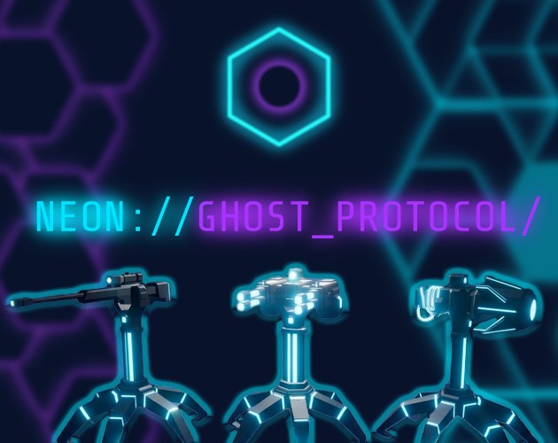
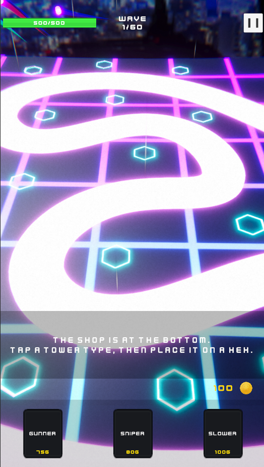
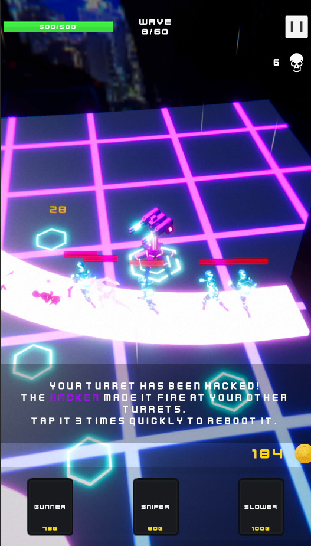
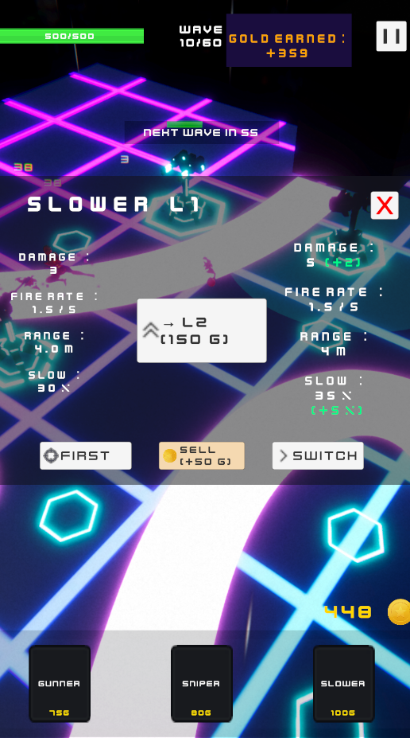
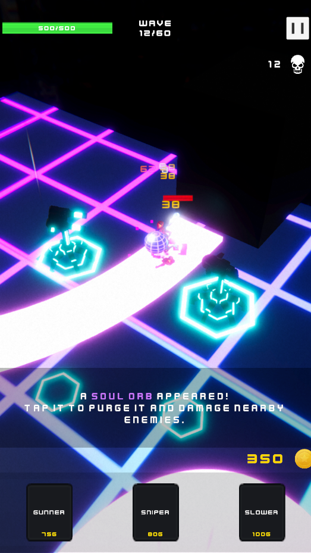
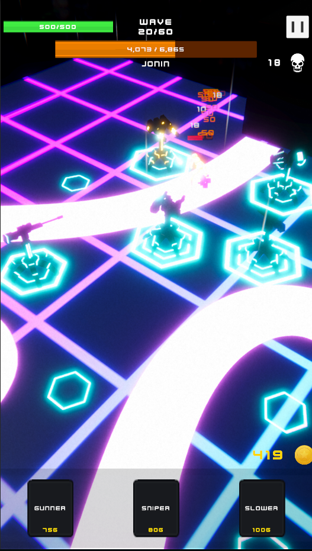

# 🌆 Neon://Ghost Protocol

A fast-paced **Tower Defense** game where you defend a futuristic city against relentless waves of cybernetic ghosts.

🎮 **Play the game:** https://radhmakesgames.itch.io/neonghost-protocol

---

# 🎮 About the Game

The city has fallen.

An endless stream of digital ghosts is invading the last secure district, and you're the only operator left to stop them.

Build your defenses, adapt your strategy, and survive increasingly difficult waves as stronger enemies begin to overwhelm your position.

Every tower placement matters.

Every upgrade counts.

Can you protect the protocol?

---

# ⚡ Features

- 🏙️ Fast-paced Tower Defense gameplay
- 👻 Multiple enemy types
- 🔫 Different defensive towers with unique roles
- 📈 Increasing difficulty through enemy waves
- 🎵 Original soundtrack
- ✨ Stylized visuals with post-processing effects
- 🌐 Play directly in your browser

---

# 📸 Screenshots

---

# 🛠️ Built With

- Unity
- C#
- Blender
- FMOD
- Git

---

# 🚧 Development

Neon://Ghost Protocol is my first publicly released Tower Defense game.

The current version is fully playable on Itch.io, and I plan to continue polishing and expanding the experience based on player feedback.

---

# 👨‍💻 Developer

Developed by **Radhroudh**.

Follow my game development journey:

- 🎥 YouTube: https://www.youtube.com/@RadhMakesGames
- 🎵 TikTok: https://www.tiktok.com/@radhmakesgames
- 🐦 X: https://x.com/RadhMakesGames
- 📷 Instagram: https://www.instagram.com/radhmakesgames/
- 🎮 Itch.io: https://radhmakesgames.itch.io/
